# 🎨 Guia de Implementação RBAC - Frontend

**Data de Criação:** 18 de novembro de 2025  
**Status:** 📘 Documentação  
**Objetivo:** Guia completo para integração do sistema RBAC no frontend

---

## 📋 Índice

1. [Visão Geral da API](#-visão-geral-da-api)
2. [Autenticação e Autorização](#-autenticação-e-autorização)
3. [Endpoints Disponíveis](#-endpoints-disponíveis)
4. [Modelos de Dados](#-modelos-de-dados)
5. [Exemplos de Requisições](#-exemplos-de-requisições)
6. [Implementação no Frontend](#-implementação-no-frontend)
7. [Componentes React Sugeridos](#-componentes-react-sugeridos)
8. [Gerenciamento de Estado](#-gerenciamento-de-estado)
9. [Boas Práticas](#-boas-práticas)
10. [Tratamento de Erros](#-tratamento-de-erros)

---

## 🔍 Visão Geral da API

### Base URL

```
https://api.opensea.com/v1/rbac
```

### Autenticação

Todas as rotas requerem:

- **Header:** `Authorization: Bearer {token}`
- **Permissão Mínima:** ADMIN (para gerenciamento de RBAC)

### Conceitos Principais

```
┌─────────────────────────────────────────────────────────────┐
│                    Sistema RBAC                              │
├─────────────────────────────────────────────────────────────┤
│                                                               │
│  Usuário ──→ Grupo de Permissões ──→ Permissões             │
│                                                               │
│  • Um usuário pode ter múltiplos grupos                      │
│  • Um grupo pode ter múltiplas permissões                    │
│  • Permissões têm efeito: allow ou deny                      │
│  • Deny sempre tem precedência sobre allow                   │
│  • Suporte a hierarquia de grupos (herança)                  │
│  • Atribuições podem ter data de expiração                   │
│                                                               │
└─────────────────────────────────────────────────────────────┘
```

### Formato de Permissões

```
<módulo>.<recurso>.<ação>

Exemplos:
✅ stock.products.create
✅ sales.orders.read
✅ core.users.update
✅ stock.*.read           # Wildcard: ler todos os recursos de stock
✅ *.variants.update      # Wildcard: atualizar variants em todos os módulos
✅ *.*.*                  # Super admin: todas as permissões
```

**Módulos Disponíveis:**

- `core` - Usuários, sessões, perfis
- `stock` - Produtos, variantes, estoque
- `sales` - Clientes, pedidos, promoções

**Ações Padrão:**

- `create` - Criar recurso
- `read` - Ler/visualizar
- `update` - Atualizar
- `delete` - Deletar
- `manage` - Gerenciar (todas as ações)

---

## 🔐 Autenticação e Autorização

### Fluxo de Verificação de Permissões

```mermaid
sequenceDiagram
    participant F as Frontend
    participant API as Backend API
    participant DB as Database

    F->>API: GET /v1/rbac/users/{userId}/permissions
    API->>DB: Busca grupos do usuário
    API->>DB: Busca permissões dos grupos
    API->>API: Aplica herança + precedência
    API->>F: Lista de permissões efetivas
    F->>F: Cache local das permissões
    F->>F: Valida ações do usuário
```



### Headers Obrigatórios

```typescript
const headers = {
  Authorization: `Bearer ${accessToken}`,
  'Content-Type': 'application/json',
};
```

---

## 📡 Endpoints Disponíveis

### 1. Permissões

#### 1.1 Criar Permissão

```http
POST /v1/rbac/permissions
```

**Body:**

```json
{
  "code": "stock.products.create",
  "name": "Create Products",
  "description": "Allows creating new products",
  "module": "stock",
  "resource": "products",
  "action": "create",
  "metadata": {}
}
```

**Response (201):**

```json
{
  "permission": {
    "id": "uuid",
    "code": "stock.products.create",
    "name": "Create Products",
    "description": "Allows creating new products",
    "module": "stock",
    "resource": "products",
    "action": "create",
    "isSystem": false,
    "metadata": {},
    "createdAt": "2025-11-18T10:00:00Z",
    "updatedAt": "2025-11-18T10:00:00Z"
  }
}
```

#### 1.2 Listar Permissões

```http
GET /v1/rbac/permissions?module=stock&page=1&limit=20
```

**Query Parameters:**

- `module` (opcional): Filtrar por módulo
- `resource` (opcional): Filtrar por recurso
- `action` (opcional): Filtrar por ação
- `isSystem` (opcional): Filtrar permissões de sistema
- `page` (default: 1): Número da página
- `limit` (default: 20, max: 100): Itens por página

**Response (200):**

```json
{
  "permissions": [
    {
      "id": "uuid",
      "code": "stock.products.create",
      "name": "Create Products",
      "description": "...",
      "module": "stock",
      "resource": "products",
      "action": "create",
      "isSystem": false,
      "metadata": {},
      "createdAt": "2025-11-18T10:00:00Z"
    }
  ],
  "pagination": {
    "page": 1,
    "limit": 20,
    "total": 50,
    "totalPages": 3
  }
}
```

#### 1.3 Buscar Permissão por Código

```http
GET /v1/rbac/permissions/code/{code}
```

**Exemplo:**

```http
GET /v1/rbac/permissions/code/stock.products.create
```

**Response (200):**

```json
{
  "permission": {
    "id": "uuid",
    "code": "stock.products.create",
    "name": "Create Products",
    "description": "...",
    "module": "stock",
    "resource": "products",
    "action": "create",
    "isSystem": false,
    "metadata": {},
    "createdAt": "2025-11-18T10:00:00Z"
  }
}
```

#### 1.4 Buscar Permissão por ID

```http
GET /v1/rbac/permissions/{id}
```

#### 1.5 Atualizar Permissão

```http
PUT /v1/rbac/permissions/{id}
```

**Body:**

```json
{
  "name": "Create and Edit Products",
  "description": "Updated description",
  "metadata": { "category": "inventory" }
}
```

**Nota:** Permissões de sistema (`isSystem: true`) não podem ser atualizadas.

#### 1.6 Deletar Permissão

```http
DELETE /v1/rbac/permissions/{id}
```

**Response (204):** No Content

**Nota:** Permissões de sistema não podem ser deletadas.

---

### 2. Grupos de Permissões

#### 2.1 Criar Grupo

```http
POST /v1/rbac/permission-groups
```

**Body:**

```json
{
  "name": "Gerente de Estoque",
  "description": "Acesso completo ao módulo de estoque",
  "color": "#3B82F6",
  "priority": 200,
  "parentId": null
}
```

**Response (201):**

```json
{
  "group": {
    "id": "uuid",
    "name": "Gerente de Estoque",
    "slug": "gerente-de-estoque",
    "description": "Acesso completo ao módulo de estoque",
    "color": "#3B82F6",
    "priority": 200,
    "isActive": true,
    "isSystem": false,
    "parentId": null,
    "createdAt": "2025-11-18T10:00:00Z",
    "updatedAt": "2025-11-18T10:00:00Z"
  }
}
```

**Observações:**

- `slug` é gerado automaticamente a partir do `name`
- `priority` define precedência em conflitos (maior = mais prioritário)
- `color` deve ser hexadecimal (#RRGGBB)
- `parentId` define grupo pai para herança

#### 2.2 Listar Grupos

```http
GET /v1/rbac/permission-groups?isActive=true&page=1&limit=20
```

**Query Parameters:**

- `isActive` (opcional): Filtrar por status
- `isSystem` (opcional): Filtrar grupos de sistema
- `includeDeleted` (default: false): Incluir deletados
- `page` (default: 1)
- `limit` (default: 20, max: 100)

**Response (200):**

```json
{
  "groups": [
    {
      "id": "uuid",
      "name": "Gerente de Estoque",
      "slug": "gerente-de-estoque",
      "description": "...",
      "color": "#3B82F6",
      "priority": 200,
      "isActive": true,
      "isSystem": false,
      "parentId": null,
      "createdAt": "2025-11-18T10:00:00Z"
    }
  ],
  "pagination": {
    "page": 1,
    "limit": 20,
    "total": 15,
    "totalPages": 1
  }
}
```

#### 2.3 Buscar Grupo por ID

```http
GET /v1/rbac/permission-groups/{id}
```

#### 2.4 Atualizar Grupo

```http
PUT /v1/rbac/permission-groups/{id}
```

**Body:**

```json
{
  "name": "Gerente de Estoque Senior",
  "description": "Atualizado",
  "color": "#10B981",
  "priority": 250,
  "parentId": "uuid-do-grupo-pai",
  "isActive": true
}
```

**Validações:**

- Não pode criar referência circular (grupo não pode ser pai de si mesmo, nem indiretamente)
- Grupos de sistema não podem ser editados

#### 2.5 Deletar Grupo

```http
DELETE /v1/rbac/permission-groups/{id}?force=false
```

**Query Parameters:**

- `force` (default: false): Se `true`, remove todos os usuários antes de deletar

**Validações:**

- Grupo não pode ter grupos filhos
- Se `force=false`, grupo não pode ter usuários atribuídos
- Grupos de sistema não podem ser deletados

---

### 3. Associações - Permissões ↔ Grupos

#### 3.1 Adicionar Permissão ao Grupo

```http
POST /v1/rbac/permission-groups/{groupId}/permissions
```

**Body:**

```json
{
  "permissionCode": "stock.products.create",
  "effect": "allow",
  "conditions": null
}
```

**Campos:**

- `permissionCode`: Código da permissão (formato: module.resource.action)
- `effect`: `"allow"` ou `"deny"` (default: "allow")
- `conditions`: Objeto JSON com condições ABAC (opcional, para uso futuro)

**Response (201):**

```json
{
  "success": true
}
```

**Observação:** Deny sempre tem precedência sobre allow.

#### 3.2 Listar Permissões de um Grupo

```http
GET /v1/rbac/permission-groups/{groupId}/permissions
```

**Response (200):**

```json
{
  "permissions": [
    {
      "id": "uuid",
      "code": "stock.products.create",
      "name": "Create Products",
      "description": "...",
      "module": "stock",
      "resource": "products",
      "action": "create",
      "isSystem": false,
      "metadata": {},
      "effect": "allow",
      "conditions": null,
      "createdAt": "2025-11-18T10:00:00Z"
    }
  ]
}
```

#### 3.3 Remover Permissão do Grupo

```http
DELETE /v1/rbac/permission-groups/{groupId}/permissions/{permissionCode}
```

**Exemplo:**

```http
DELETE /v1/rbac/permission-groups/uuid/permissions/stock.products.create
```

**Response (204):** No Content

---

### 4. Associações - Usuários ↔ Grupos

#### 4.1 Atribuir Grupo ao Usuário

```http
POST /v1/rbac/users/{userId}/groups
```

**Body:**

```json
{
  "groupId": "uuid",
  "expiresAt": "2026-12-31T23:59:59Z",
  "grantedBy": "uuid-do-admin"
}
```

**Campos:**

- `groupId`: ID do grupo a ser atribuído
- `expiresAt` (opcional): Data de expiração do acesso
- `grantedBy` (opcional): ID do usuário que concedeu (para auditoria)

**Response (201):**

```json
{
  "success": true
}
```

**Observações:**

- Se usuário já possui o grupo, atualiza `expiresAt`
- Data de expiração é opcional (null = permanente)

#### 4.2 Listar Grupos de um Usuário

```http
GET /v1/rbac/users/{userId}/groups?includeExpired=false&includeInactive=false
```

**Query Parameters:**

- `includeExpired` (default: false): Incluir grupos expirados
- `includeInactive` (default: false): Incluir grupos inativos

**Response (200):**

```json
{
  "groups": [
    {
      "group": {
        "id": "uuid",
        "name": "Gerente de Estoque",
        "slug": "gerente-de-estoque",
        "description": "...",
        "color": "#3B82F6",
        "priority": 200,
        "isActive": true,
        "isSystem": false,
        "parentId": null,
        "createdAt": "2025-11-18T10:00:00Z"
      },
      "expiresAt": "2026-12-31T23:59:59Z",
      "grantedAt": "2025-11-18T10:00:00Z"
    }
  ]
}
```

#### 4.3 Listar Permissões Efetivas de um Usuário

```http
GET /v1/rbac/users/{userId}/permissions
```

**Response (200):**

```json
{
  "permissions": [
    {
      "permission": {
        "id": "uuid",
        "code": "stock.products.create",
        "name": "Create Products",
        "description": "...",
        "module": "stock",
        "resource": "products",
        "action": "create",
        "isSystem": false,
        "metadata": {},
        "createdAt": "2025-11-18T10:00:00Z"
      },
      "effect": "allow",
      "source": "direct",
      "groupIds": ["uuid-grupo-1", "uuid-grupo-2"]
    },
    {
      "permission": {
        "id": "uuid",
        "code": "sales.orders.delete",
        "name": "Delete Orders",
        "description": "...",
        "module": "sales",
        "resource": "orders",
        "action": "delete",
        "isSystem": false,
        "metadata": {},
        "createdAt": "2025-11-18T10:00:00Z"
      },
      "effect": "deny",
      "source": "inherited",
      "groupIds": ["uuid-grupo-pai"]
    }
  ]
}
```

**Campos do Retorno:**

- `effect`: "allow" ou "deny" (após aplicar precedência)
- `source`: "direct" (do próprio grupo) ou "inherited" (de grupo pai)
- `groupIds`: Lista de grupos que concedem essa permissão

**Observações:**

- Inclui permissões de grupos ancestrais (herança hierárquica)
- Aplica precedência: deny > allow
- Exclui grupos expirados e inativos automaticamente

#### 4.4 Listar Usuários de um Grupo

```http
GET /v1/rbac/permission-groups/{groupId}/users?includeExpired=false
```

**Query Parameters:**

- `includeExpired` (default: false): Incluir usuários com acesso expirado

**Response (200):**

```json
{
  "users": [
    {
      "id": "uuid",
      "username": "joao.silva",
      "email": "joao@example.com",
      "role": "USER",
      "assignedAt": "2025-11-18T10:00:00Z",
      "expiresAt": "2026-12-31T23:59:59Z"
    }
  ]
}
```

#### 4.5 Remover Grupo do Usuário

```http
DELETE /v1/rbac/users/{userId}/groups/{groupId}
```

**Response (204):** No Content

---

## 📦 Modelos de Dados

### TypeScript Interfaces

```typescript
// ============================================
// PERMISSION
// ============================================

interface Permission {
  id: string;
  code: string; // module.resource.action
  name: string;
  description: string | null;
  module: string;
  resource: string;
  action: string;
  isSystem: boolean;
  metadata: Record<string, unknown>;
  createdAt: string; // ISO 8601
  updatedAt?: string;
}

interface CreatePermissionDTO {
  code: string;
  name: string;
  description?: string | null;
  module: string;
  resource: string;
  action: string;
  metadata?: Record<string, unknown>;
}

interface UpdatePermissionDTO {
  name?: string;
  description?: string | null;
  metadata?: Record<string, unknown>;
}

interface ListPermissionsQuery {
  module?: string;
  resource?: string;
  action?: string;
  isSystem?: boolean;
  page?: number;
  limit?: number;
}

// ============================================
// PERMISSION GROUP
// ============================================

interface PermissionGroup {
  id: string;
  name: string;
  slug: string;
  description: string | null;
  color: string | null; // hex color
  priority: number;
  isActive: boolean;
  isSystem: boolean;
  parentId: string | null;
  createdAt: string;
  updatedAt?: string;
  deletedAt?: string | null;
}

interface CreatePermissionGroupDTO {
  name: string;
  description?: string | null;
  color?: string; // #RRGGBB
  priority?: number; // default: 100
  parentId?: string | null;
}

interface UpdatePermissionGroupDTO {
  name?: string;
  description?: string | null;
  color?: string | null;
  priority?: number;
  parentId?: string | null;
  isActive?: boolean;
}

interface ListPermissionGroupsQuery {
  isActive?: boolean;
  isSystem?: boolean;
  includeDeleted?: boolean;
  page?: number;
  limit?: number;
}

// ============================================
// ASSOCIATIONS
// ============================================

interface PermissionWithEffect extends Permission {
  effect: 'allow' | 'deny';
  conditions: Record<string, unknown> | null;
}

interface AddPermissionToGroupDTO {
  permissionCode: string;
  effect?: 'allow' | 'deny'; // default: 'allow'
  conditions?: Record<string, unknown> | null;
}

interface AssignGroupToUserDTO {
  groupId: string;
  expiresAt?: string | null; // ISO 8601
  grantedBy?: string | null;
}

interface GroupWithExpiration {
  group: PermissionGroup;
  expiresAt: string | null;
  grantedAt: string;
}

interface EffectivePermission {
  permission: Permission;
  effect: 'allow' | 'deny';
  source: 'direct' | 'inherited';
  groupIds: string[];
}

interface UserInGroup {
  id: string;
  username: string;
  email: string;
  role: 'USER' | 'MANAGER' | 'ADMIN';
  assignedAt: string;
  expiresAt: string | null;
}

// ============================================
// API RESPONSES
// ============================================

interface ApiResponse<T> {
  data?: T;
  error?: string;
  message?: string;
}

interface PaginatedResponse<T> {
  data: T[];
  pagination: {
    page: number;
    limit: number;
    total: number;
    totalPages: number;
  };
}

interface PermissionResponse {
  permission: Permission;
}

interface PermissionGroupResponse {
  group: PermissionGroup;
}

interface SuccessResponse {
  success: boolean;
}
```

---

## 💻 Exemplos de Requisições

### Exemplo 1: Criar Permissão Customizada

```typescript
const createCustomPermission = async () => {
  const response = await fetch('https://api.opensea.com/v1/rbac/permissions', {
    method: 'POST',
    headers: {
      Authorization: `Bearer ${token}`,
      'Content-Type': 'application/json',
    },
    body: JSON.stringify({
      code: 'stock.suppliers.manage',
      name: 'Manage Suppliers',
      description: 'Full access to supplier management',
      module: 'stock',
      resource: 'suppliers',
      action: 'manage',
      metadata: {
        category: 'inventory',
        critical: true,
      },
    }),
  });

  const { permission } = await response.json();
  return permission;
};
```

### Exemplo 2: Criar Grupo de Permissões Hierárquico

```typescript
// 1. Criar grupo pai
const parentGroup = await fetch(
  'https://api.opensea.com/v1/rbac/permission-groups',
  {
    method: 'POST',
    headers: {
      Authorization: `Bearer ${token}`,
      'Content-Type': 'application/json',
    },
    body: JSON.stringify({
      name: 'Equipe de Vendas',
      description: 'Grupo base para vendedores',
      color: '#EF4444',
      priority: 100,
      parentId: null,
    }),
  },
);

const { group: parent } = await parentGroup.json();

// 2. Criar grupo filho que herda do pai
const childGroup = await fetch(
  'https://api.opensea.com/v1/rbac/permission-groups',
  {
    method: 'POST',
    headers: {
      Authorization: `Bearer ${token}`,
      'Content-Type': 'application/json',
    },
    body: JSON.stringify({
      name: 'Vendedor Senior',
      description: 'Vendedor com permissões extras',
      color: '#10B981',
      priority: 150,
      parentId: parent.id, // Herda permissões do grupo pai
    }),
  },
);
```

### Exemplo 3: Adicionar Permissões com Efeito Allow/Deny

```typescript
const setupGroupPermissions = async (groupId: string) => {
  // Permitir criar e ler pedidos
  await fetch(
    `https://api.opensea.com/v1/rbac/permission-groups/${groupId}/permissions`,
    {
      method: 'POST',
      headers: {
        Authorization: `Bearer ${token}`,
        'Content-Type': 'application/json',
      },
      body: JSON.stringify({
        permissionCode: 'sales.orders.create',
        effect: 'allow',
      }),
    },
  );

  await fetch(
    `https://api.opensea.com/v1/rbac/permission-groups/${groupId}/permissions`,
    {
      method: 'POST',
      headers: {
        Authorization: `Bearer ${token}`,
        'Content-Type': 'application/json',
      },
      body: JSON.stringify({
        permissionCode: 'sales.orders.read',
        effect: 'allow',
      }),
    },
  );

  // Explicitamente NEGAR deletar pedidos (deny tem precedência)
  await fetch(
    `https://api.opensea.com/v1/rbac/permission-groups/${groupId}/permissions`,
    {
      method: 'POST',
      headers: {
        Authorization: `Bearer ${token}`,
        'Content-Type': 'application/json',
      },
      body: JSON.stringify({
        permissionCode: 'sales.orders.delete',
        effect: 'deny',
      }),
    },
  );
};
```

### Exemplo 4: Atribuir Grupo com Expiração

```typescript
const assignTemporaryAccess = async (userId: string, groupId: string) => {
  // Acesso temporário por 30 dias
  const expiresAt = new Date();
  expiresAt.setDate(expiresAt.getDate() + 30);

  const response = await fetch(
    `https://api.opensea.com/v1/rbac/users/${userId}/groups`,
    {
      method: 'POST',
      headers: {
        Authorization: `Bearer ${token}`,
        'Content-Type': 'application/json',
      },
      body: JSON.stringify({
        groupId,
        expiresAt: expiresAt.toISOString(),
        grantedBy: currentUserId,
      }),
    },
  );

  return response.ok;
};
```

### Exemplo 5: Verificar Permissões do Usuário

```typescript
const checkUserPermissions = async (userId: string) => {
  const response = await fetch(
    `https://api.opensea.com/v1/rbac/users/${userId}/permissions`,
    {
      headers: {
        Authorization: `Bearer ${token}`,
      },
    },
  );

  const { permissions } = await response.json();

  // Criar mapa para verificação rápida
  const permissionMap = new Map<string, 'allow' | 'deny'>();
  permissions.forEach((p: EffectivePermission) => {
    permissionMap.set(p.permission.code, p.effect);
  });

  // Verificar permissão específica
  const canCreateProducts =
    permissionMap.get('stock.products.create') === 'allow';
  const canDeleteOrders = permissionMap.get('sales.orders.delete') !== 'deny';

  return { canCreateProducts, canDeleteOrders, permissionMap };
};
```

---

## 🎨 Implementação no Frontend

### 1. Serviço de API (api/rbac.service.ts)

```typescript
import axios, { AxiosInstance } from 'axios';

export class RBACService {
  private api: AxiosInstance;

  constructor(baseURL: string, getToken: () => string) {
    this.api = axios.create({
      baseURL: `${baseURL}/v1/rbac`,
      headers: {
        'Content-Type': 'application/json',
      },
    });

    // Interceptor para adicionar token
    this.api.interceptors.request.use((config) => {
      const token = getToken();
      if (token) {
        config.headers.Authorization = `Bearer ${token}`;
      }
      return config;
    });
  }

  // ==========================================
  // PERMISSIONS
  // ==========================================

  async createPermission(data: CreatePermissionDTO) {
    const response = await this.api.post<PermissionResponse>(
      '/permissions',
      data,
    );
    return response.data.permission;
  }

  async listPermissions(query?: ListPermissionsQuery) {
    const response = await this.api.get<PaginatedResponse<Permission>>(
      '/permissions',
      {
        params: query,
      },
    );
    return response.data;
  }

  async getPermissionByCode(code: string) {
    const response = await this.api.get<PermissionResponse>(
      `/permissions/code/${code}`,
    );
    return response.data.permission;
  }

  async getPermissionById(id: string) {
    const response = await this.api.get<PermissionResponse>(
      `/permissions/${id}`,
    );
    return response.data.permission;
  }

  async updatePermission(id: string, data: UpdatePermissionDTO) {
    const response = await this.api.put<PermissionResponse>(
      `/permissions/${id}`,
      data,
    );
    return response.data.permission;
  }

  async deletePermission(id: string) {
    await this.api.delete(`/permissions/${id}`);
  }

  // ==========================================
  // PERMISSION GROUPS
  // ==========================================

  async createPermissionGroup(data: CreatePermissionGroupDTO) {
    const response = await this.api.post<PermissionGroupResponse>(
      '/permission-groups',
      data,
    );
    return response.data.group;
  }

  async listPermissionGroups(query?: ListPermissionGroupsQuery) {
    const response = await this.api.get<PaginatedResponse<PermissionGroup>>(
      '/permission-groups',
      {
        params: query,
      },
    );
    return response.data;
  }

  async getPermissionGroupById(id: string) {
    const response = await this.api.get<PermissionGroupResponse>(
      `/permission-groups/${id}`,
    );
    return response.data.group;
  }

  async updatePermissionGroup(id: string, data: UpdatePermissionGroupDTO) {
    const response = await this.api.put<PermissionGroupResponse>(
      `/permission-groups/${id}`,
      data,
    );
    return response.data.group;
  }

  async deletePermissionGroup(id: string, force = false) {
    await this.api.delete(`/permission-groups/${id}`, {
      params: { force },
    });
  }

  // ==========================================
  // GROUP ↔ PERMISSIONS
  // ==========================================

  async addPermissionToGroup(groupId: string, data: AddPermissionToGroupDTO) {
    const response = await this.api.post<SuccessResponse>(
      `/permission-groups/${groupId}/permissions`,
      data,
    );
    return response.data.success;
  }

  async listGroupPermissions(groupId: string) {
    const response = await this.api.get<{
      permissions: PermissionWithEffect[];
    }>(`/permission-groups/${groupId}/permissions`);
    return response.data.permissions;
  }

  async removePermissionFromGroup(groupId: string, permissionCode: string) {
    await this.api.delete(
      `/permission-groups/${groupId}/permissions/${permissionCode}`,
    );
  }

  // ==========================================
  // USER ↔ GROUPS
  // ==========================================

  async assignGroupToUser(userId: string, data: AssignGroupToUserDTO) {
    const response = await this.api.post<SuccessResponse>(
      `/users/${userId}/groups`,
      data,
    );
    return response.data.success;
  }

  async listUserGroups(
    userId: string,
    includeExpired = false,
    includeInactive = false,
  ) {
    const response = await this.api.get<{ groups: GroupWithExpiration[] }>(
      `/users/${userId}/groups`,
      {
        params: { includeExpired, includeInactive },
      },
    );
    return response.data.groups;
  }

  async listUserPermissions(userId: string) {
    const response = await this.api.get<{ permissions: EffectivePermission[] }>(
      `/users/${userId}/permissions`,
    );
    return response.data.permissions;
  }

  async listUsersByGroup(groupId: string, includeExpired = false) {
    const response = await this.api.get<{ users: UserInGroup[] }>(
      `/permission-groups/${groupId}/users`,
      {
        params: { includeExpired },
      },
    );
    return response.data.users;
  }

  async removeGroupFromUser(userId: string, groupId: string) {
    await this.api.delete(`/users/${userId}/groups/${groupId}`);
  }
}
```

---

## ⚛️ Componentes React Sugeridos

### 1. Hook de Permissões (usePermissions.ts)

```typescript
import { useEffect, useState } from 'react';
import { useAuth } from './useAuth'; // seu hook de autenticação
import { RBACService } from '../services/rbac.service';

interface UsePermissionsReturn {
  permissions: Map<string, 'allow' | 'deny'>;
  hasPermission: (code: string) => boolean;
  isLoading: boolean;
  error: Error | null;
  refresh: () => Promise<void>;
}

export const usePermissions = (): UsePermissionsReturn => {
  const { user, token } = useAuth();
  const [permissions, setPermissions] = useState<Map<string, 'allow' | 'deny'>>(
    new Map(),
  );
  const [isLoading, setIsLoading] = useState(true);
  const [error, setError] = useState<Error | null>(null);

  const fetchPermissions = async () => {
    if (!user || !token) {
      setPermissions(new Map());
      setIsLoading(false);
      return;
    }

    try {
      setIsLoading(true);
      setError(null);

      const rbacService = new RBACService(
        process.env.REACT_APP_API_URL!,
        () => token,
      );
      const userPermissions = await rbacService.listUserPermissions(user.id);

      const permMap = new Map<string, 'allow' | 'deny'>();
      userPermissions.forEach((p) => {
        permMap.set(p.permission.code, p.effect);
      });

      setPermissions(permMap);

      // Cache no localStorage (15 minutos)
      localStorage.setItem(
        'user_permissions',
        JSON.stringify(Array.from(permMap.entries())),
      );
      localStorage.setItem('user_permissions_timestamp', Date.now().toString());
    } catch (err) {
      setError(err as Error);
      console.error('Failed to fetch permissions:', err);
    } finally {
      setIsLoading(false);
    }
  };

  // Carregar do cache primeiro
  useEffect(() => {
    const cached = localStorage.getItem('user_permissions');
    const timestamp = localStorage.getItem('user_permissions_timestamp');

    if (cached && timestamp) {
      const age = Date.now() - parseInt(timestamp);
      const fifteenMinutes = 15 * 60 * 1000;

      if (age < fifteenMinutes) {
        const entries = JSON.parse(cached) as [string, 'allow' | 'deny'][];
        setPermissions(new Map(entries));
        setIsLoading(false);
        return;
      }
    }

    fetchPermissions();
  }, [user, token]);

  const hasPermission = (code: string): boolean => {
    const effect = permissions.get(code);
    return effect === 'allow';
  };

  return {
    permissions,
    hasPermission,
    isLoading,
    error,
    refresh: fetchPermissions,
  };
};
```

### 2. Componente de Guarda de Permissão (PermissionGuard.tsx)

```typescript
import React from 'react';
import { usePermissions } from '../hooks/usePermissions';

interface PermissionGuardProps {
  permission: string;
  fallback?: React.ReactNode;
  children: React.ReactNode;
}

export const PermissionGuard: React.FC<PermissionGuardProps> = ({
  permission,
  fallback = null,
  children,
}) => {
  const { hasPermission, isLoading } = usePermissions();

  if (isLoading) {
    return <div>Loading permissions...</div>;
  }

  if (!hasPermission(permission)) {
    return <>{fallback}</>;
  }

  return <>{children}</>;
};

// Uso:
// <PermissionGuard permission="stock.products.create">
//   <CreateProductButton />
// </PermissionGuard>
```

### 3. HOC de Permissão (withPermission.tsx)

```typescript
import React from 'react';
import { usePermissions } from '../hooks/usePermissions';

export function withPermission<P extends object>(
  Component: React.ComponentType<P>,
  permission: string,
  FallbackComponent?: React.ComponentType<P>
) {
  return (props: P) => {
    const { hasPermission, isLoading } = usePermissions();

    if (isLoading) {
      return <div>Loading...</div>;
    }

    if (!hasPermission(permission)) {
      return FallbackComponent ? <FallbackComponent {...props} /> : null;
    }

    return <Component {...props} />;
  };
}

// Uso:
// const ProtectedComponent = withPermission(MyComponent, 'stock.products.create');
```

### 4. Componente de Gerenciamento de Grupos (PermissionGroupManager.tsx)

```typescript
import React, { useState, useEffect } from 'react';
import { RBACService } from '../services/rbac.service';
import { useAuth } from '../hooks/useAuth';

export const PermissionGroupManager: React.FC = () => {
  const { token } = useAuth();
  const [groups, setGroups] = useState<PermissionGroup[]>([]);
  const [isLoading, setIsLoading] = useState(true);

  const rbacService = new RBACService(process.env.REACT_APP_API_URL!, () => token);

  useEffect(() => {
    loadGroups();
  }, []);

  const loadGroups = async () => {
    try {
      setIsLoading(true);
      const { data } = await rbacService.listPermissionGroups();
      setGroups(data);
    } catch (error) {
      console.error('Failed to load groups:', error);
    } finally {
      setIsLoading(false);
    }
  };

  const handleCreateGroup = async (data: CreatePermissionGroupDTO) => {
    try {
      await rbacService.createPermissionGroup(data);
      await loadGroups();
    } catch (error) {
      console.error('Failed to create group:', error);
    }
  };

  const handleDeleteGroup = async (id: string, force: boolean) => {
    try {
      await rbacService.deletePermissionGroup(id, force);
      await loadGroups();
    } catch (error) {
      console.error('Failed to delete group:', error);
    }
  };

  if (isLoading) {
    return <div>Loading groups...</div>;
  }

  return (
    <div className="permission-groups">
      <h2>Permission Groups</h2>

      {/* Form de criação */}
      <CreateGroupForm onSubmit={handleCreateGroup} />

      {/* Lista de grupos */}
      <div className="groups-list">
        {groups.map((group) => (
          <GroupCard
            key={group.id}
            group={group}
            onDelete={(force) => handleDeleteGroup(group.id, force)}
          />
        ))}
      </div>
    </div>
  );
};
```

### 5. Componente de Seleção de Permissões (PermissionSelector.tsx)

```typescript
import React, { useState, useEffect } from 'react';
import { RBACService } from '../services/rbac.service';
import { useAuth } from '../hooks/useAuth';

interface PermissionSelectorProps {
  selectedPermissions: string[];
  onSelectionChange: (permissions: string[]) => void;
  module?: string;
}

export const PermissionSelector: React.FC<PermissionSelectorProps> = ({
  selectedPermissions,
  onSelectionChange,
  module,
}) => {
  const { token } = useAuth();
  const [permissions, setPermissions] = useState<Permission[]>([]);
  const [isLoading, setIsLoading] = useState(true);

  const rbacService = new RBACService(process.env.REACT_APP_API_URL!, () => token);

  useEffect(() => {
    loadPermissions();
  }, [module]);

  const loadPermissions = async () => {
    try {
      setIsLoading(true);
      const { data } = await rbacService.listPermissions({ module, limit: 100 });
      setPermissions(data);
    } catch (error) {
      console.error('Failed to load permissions:', error);
    } finally {
      setIsLoading(false);
    }
  };

  const handleToggle = (code: string) => {
    const newSelection = selectedPermissions.includes(code)
      ? selectedPermissions.filter((p) => p !== code)
      : [...selectedPermissions, code];

    onSelectionChange(newSelection);
  };

  if (isLoading) {
    return <div>Loading permissions...</div>;
  }

  // Agrupar por módulo e recurso
  const groupedPermissions = permissions.reduce((acc, perm) => {
    const key = `${perm.module}.${perm.resource}`;
    if (!acc[key]) {
      acc[key] = [];
    }
    acc[key].push(perm);
    return acc;
  }, {} as Record<string, Permission[]>);

  return (
    <div className="permission-selector">
      {Object.entries(groupedPermissions).map(([key, perms]) => (
        <div key={key} className="permission-group">
          <h4>{key}</h4>
          {perms.map((perm) => (
            <label key={perm.id} className="permission-item">
              <input
                type="checkbox"
                checked={selectedPermissions.includes(perm.code)}
                onChange={() => handleToggle(perm.code)}
              />
              <span>{perm.name}</span>
              <small>{perm.description}</small>
            </label>
          ))}
        </div>
      ))}
    </div>
  );
};
```

---

## 🗄️ Gerenciamento de Estado

### Opção 1: Context API + React Query

```typescript
// contexts/PermissionsContext.tsx
import React, { createContext, useContext } from 'react';
import { useQuery, useMutation, useQueryClient } from '@tanstack/react-query';
import { RBACService } from '../services/rbac.service';
import { useAuth } from './AuthContext';

interface PermissionsContextValue {
  permissions: Map<string, 'allow' | 'deny'>;
  hasPermission: (code: string) => boolean;
  isLoading: boolean;
  refresh: () => void;
}

const PermissionsContext = createContext<PermissionsContextValue | undefined>(undefined);

export const PermissionsProvider: React.FC<{ children: React.ReactNode }> = ({ children }) => {
  const { user, token } = useAuth();
  const queryClient = useQueryClient();

  const rbacService = new RBACService(process.env.REACT_APP_API_URL!, () => token);

  const { data: permissions = new Map(), isLoading } = useQuery({
    queryKey: ['user-permissions', user?.id],
    queryFn: async () => {
      if (!user) return new Map();

      const perms = await rbacService.listUserPermissions(user.id);
      const map = new Map<string, 'allow' | 'deny'>();
      perms.forEach((p) => map.set(p.permission.code, p.effect));
      return map;
    },
    enabled: !!user,
    staleTime: 15 * 60 * 1000, // 15 minutos
    cacheTime: 30 * 60 * 1000, // 30 minutos
  });

  const hasPermission = (code: string) => {
    return permissions.get(code) === 'allow';
  };

  const refresh = () => {
    queryClient.invalidateQueries(['user-permissions', user?.id]);
  };

  return (
    <PermissionsContext.Provider value={{ permissions, hasPermission, isLoading, refresh }}>
      {children}
    </PermissionsContext.Provider>
  );
};

export const usePermissions = () => {
  const context = useContext(PermissionsContext);
  if (!context) {
    throw new Error('usePermissions must be used within PermissionsProvider');
  }
  return context;
};
```

### Opção 2: Redux Toolkit

```typescript
// store/slices/permissionsSlice.ts
import { createSlice, createAsyncThunk, PayloadAction } from '@reduxjs/toolkit';
import { RBACService } from '../../services/rbac.service';

interface PermissionsState {
  permissions: Map<string, 'allow' | 'deny'>;
  isLoading: boolean;
  error: string | null;
  lastFetch: number | null;
}

const initialState: PermissionsState = {
  permissions: new Map(),
  isLoading: false,
  error: null,
  lastFetch: null,
};

export const fetchUserPermissions = createAsyncThunk(
  'permissions/fetchUserPermissions',
  async ({ userId, token }: { userId: string; token: string }) => {
    const rbacService = new RBACService(
      process.env.REACT_APP_API_URL!,
      () => token,
    );
    const perms = await rbacService.listUserPermissions(userId);

    const map = new Map<string, 'allow' | 'deny'>();
    perms.forEach((p) => map.set(p.permission.code, p.effect));

    return Object.fromEntries(map);
  },
);

const permissionsSlice = createSlice({
  name: 'permissions',
  initialState,
  reducers: {
    clearPermissions: (state) => {
      state.permissions = new Map();
      state.lastFetch = null;
    },
  },
  extraReducers: (builder) => {
    builder
      .addCase(fetchUserPermissions.pending, (state) => {
        state.isLoading = true;
        state.error = null;
      })
      .addCase(
        fetchUserPermissions.fulfilled,
        (state, action: PayloadAction<Record<string, 'allow' | 'deny'>>) => {
          state.permissions = new Map(Object.entries(action.payload));
          state.isLoading = false;
          state.lastFetch = Date.now();
        },
      )
      .addCase(fetchUserPermissions.rejected, (state, action) => {
        state.isLoading = false;
        state.error = action.error.message || 'Failed to fetch permissions';
      });
  },
});

export const { clearPermissions } = permissionsSlice.actions;
export default permissionsSlice.reducer;

// Selector
export const selectHasPermission = (code: string) => (state: RootState) => {
  return state.permissions.permissions.get(code) === 'allow';
};
```

---

## ✅ Boas Práticas

### 1. Cache de Permissões

- ✅ Cache permissões no lado do cliente por 15-30 minutos
- ✅ Invalide o cache quando usuário fizer alterações em grupos
- ✅ Use localStorage como fallback durante inicialização

### 2. Carregamento Eager vs Lazy

```typescript
// Eager: Carregar permissões no login
useEffect(() => {
  if (user) {
    fetchPermissions(user.id);
  }
}, [user]);

// Lazy: Carregar apenas quando necessário
const canUserCreate = async () => {
  if (!permissionsLoaded) {
    await fetchPermissions(user.id);
  }
  return hasPermission('stock.products.create');
};
```

### 3. Otimização de UI

```typescript
// Evite verificar permissão em cada render
const canEdit = useMemo(() => {
  return hasPermission('stock.products.update');
}, [permissions]);

// Use loading states
if (isLoadingPermissions) {
  return <Skeleton />;
}
```

### 4. Mensagens de Erro Claras

```typescript
if (!hasPermission('stock.products.delete')) {
  toast.error(
    'Você não tem permissão para deletar produtos. Entre em contato com o administrador.',
  );
  return;
}
```

### 5. Auditoria Frontend

```typescript
const logPermissionDenial = (permissionCode: string, action: string) => {
  // Enviar para analytics
  analytics.track('permission_denied', {
    userId: user.id,
    permissionCode,
    action,
    timestamp: new Date().toISOString(),
  });
};
```

---

## ⚠️ Tratamento de Erros

### Códigos de Status HTTP

| Status | Significado      | Ação Sugerida                            |
| ------ | ---------------- | ---------------------------------------- |
| 200    | Sucesso          | Processar resposta                       |
| 201    | Criado           | Atualizar lista                          |
| 204    | Deletado         | Remover da UI                            |
| 400    | Bad Request      | Mostrar erro de validação                |
| 401    | Não autenticado  | Redirecionar para login                  |
| 403    | Sem permissão    | Mostrar mensagem de acesso negado        |
| 404    | Não encontrado   | Mostrar erro "não encontrado"            |
| 409    | Conflito         | Mostrar erro de duplicação               |
| 500    | Erro do servidor | Mostrar erro genérico e tentar novamente |

### Exemplo de Tratamento

```typescript
const handleCreateGroup = async (data: CreatePermissionGroupDTO) => {
  try {
    const group = await rbacService.createPermissionGroup(data);
    toast.success('Grupo criado com sucesso!');
    return group;
  } catch (error) {
    if (axios.isAxiosError(error)) {
      const status = error.response?.status;
      const message = error.response?.data?.message;

      switch (status) {
        case 400:
          toast.error(`Dados inválidos: ${message}`);
          break;
        case 401:
          toast.error('Sessão expirada. Faça login novamente.');
          router.push('/login');
          break;
        case 403:
          toast.error('Você não tem permissão para criar grupos.');
          break;
        case 409:
          toast.error('Já existe um grupo com este nome.');
          break;
        default:
          toast.error('Erro ao criar grupo. Tente novamente.');
      }
    } else {
      toast.error('Erro inesperado. Tente novamente.');
    }
    throw error;
  }
};
```

### Validações Específicas

```typescript
// Validar permissão antes de ação crítica
const handleDeleteProduct = async (productId: string) => {
  if (!hasPermission('stock.products.delete')) {
    toast.error('Você não tem permissão para deletar produtos');
    return;
  }

  const confirmed = await confirm(
    'Tem certeza que deseja deletar este produto?',
  );
  if (!confirmed) return;

  try {
    await productService.delete(productId);
    toast.success('Produto deletado com sucesso!');
  } catch (error) {
    handleError(error);
  }
};
```

---

## 📚 Exemplos Completos de Fluxos

### Fluxo 1: Setup Inicial do Sistema

```typescript
// 1. Criar permissões base
const setupBasePermissions = async () => {
  const basePermissions = [
    {
      code: 'stock.products.create',
      name: 'Create Products',
      module: 'stock',
      resource: 'products',
      action: 'create',
    },
    {
      code: 'stock.products.read',
      name: 'Read Products',
      module: 'stock',
      resource: 'products',
      action: 'read',
    },
    {
      code: 'stock.products.update',
      name: 'Update Products',
      module: 'stock',
      resource: 'products',
      action: 'update',
    },
    {
      code: 'stock.products.delete',
      name: 'Delete Products',
      module: 'stock',
      resource: 'products',
      action: 'delete',
    },
    // ... mais permissões
  ];

  for (const perm of basePermissions) {
    await rbacService.createPermission(perm);
  }
};

// 2. Criar grupos
const setupGroups = async () => {
  // Grupo Admin
  const adminGroup = await rbacService.createPermissionGroup({
    name: 'Administrador',
    description: 'Acesso total ao sistema',
    color: '#EF4444',
    priority: 1000,
  });

  // Adicionar permissão wildcard
  await rbacService.addPermissionToGroup(adminGroup.id, {
    permissionCode: '*.*.*',
    effect: 'allow',
  });

  // Grupo Gerente de Estoque
  const stockManager = await rbacService.createPermissionGroup({
    name: 'Gerente de Estoque',
    description: 'Gerencia produtos e variantes',
    color: '#3B82F6',
    priority: 500,
  });

  // Adicionar permissões específicas
  await rbacService.addPermissionToGroup(stockManager.id, {
    permissionCode: 'stock.*.manage',
    effect: 'allow',
  });

  // Grupo Vendedor
  const seller = await rbacService.createPermissionGroup({
    name: 'Vendedor',
    description: 'Visualiza produtos e cria pedidos',
    color: '#10B981',
    priority: 100,
  });

  await rbacService.addPermissionToGroup(seller.id, {
    permissionCode: 'stock.*.read',
    effect: 'allow',
  });

  await rbacService.addPermissionToGroup(seller.id, {
    permissionCode: 'sales.orders.create',
    effect: 'allow',
  });

  // Vendedor NÃO pode deletar pedidos
  await rbacService.addPermissionToGroup(seller.id, {
    permissionCode: 'sales.orders.delete',
    effect: 'deny',
  });
};

// 3. Atribuir grupos a usuários
const assignGroupsToUsers = async () => {
  // Admin permanente
  await rbacService.assignGroupToUser(adminUserId, {
    groupId: adminGroupId,
    expiresAt: null,
  });

  // Vendedor com acesso temporário (3 meses)
  const expiresAt = new Date();
  expiresAt.setMonth(expiresAt.getMonth() + 3);

  await rbacService.assignGroupToUser(sellerUserId, {
    groupId: sellerGroupId,
    expiresAt: expiresAt.toISOString(),
    grantedBy: adminUserId,
  });
};
```

### Fluxo 2: Interface de Gerenciamento Completa

```typescript
// pages/admin/permissions.tsx
import React from 'react';
import { PermissionGuard } from '../components/PermissionGuard';
import { PermissionGroupManager } from '../components/PermissionGroupManager';
import { UserPermissionManager } from '../components/UserPermissionManager';

export const PermissionsPage: React.FC = () => {
  return (
    <PermissionGuard
      permission="core.rbac.manage"
      fallback={
        <div className="access-denied">
          <h1>Acesso Negado</h1>
          <p>Você não tem permissão para acessar esta página.</p>
        </div>
      }
    >
      <div className="permissions-page">
        <h1>Gerenciamento de Permissões</h1>

        <Tabs>
          <TabPanel label="Grupos">
            <PermissionGroupManager />
          </TabPanel>

          <TabPanel label="Usuários">
            <UserPermissionManager />
          </TabPanel>

          <TabPanel label="Permissões">
            <PermissionList />
          </TabPanel>

          <TabPanel label="Auditoria">
            <PermissionAuditLog />
          </TabPanel>
        </Tabs>
      </div>
    </PermissionGuard>
  );
};
```

---

## 🎯 Checklist de Implementação

### Backend (API)

- [x] Todos os endpoints implementados
- [x] Testes E2E completos (96/96)
- [x] Validações com Zod
- [x] Tratamento de erros
- [x] Documentação Swagger

### Frontend

- [ ] Serviço de API (RBACService)
- [ ] Hook de permissões (usePermissions)
- [ ] Context/Provider de permissões
- [ ] Componente PermissionGuard
- [ ] HOC withPermission
- [ ] Interface de gerenciamento de grupos
- [ ] Interface de gerenciamento de usuários
- [ ] Interface de visualização de permissões
- [ ] Cache de permissões
- [ ] Tratamento de erros
- [ ] Loading states
- [ ] Testes unitários
- [ ] Documentação

---

## 🚀 Próximos Passos

1. **Implementar Serviço de API** no frontend
2. **Criar Context de Permissões** com React Query
3. **Desenvolver Componentes UI** para gerenciamento
4. **Adicionar Proteção de Rotas** baseada em permissões
5. **Implementar Cache Inteligente** de permissões
6. **Criar Dashboard de Auditoria** (opcional)
7. **Adicionar Testes E2E** no frontend

---

## 📞 Suporte

Em caso de dúvidas ou problemas:

- Documentação Backend: `docs/RBAC_PLANNING.md`
- Documentação de Casos de Uso: `docs/RBAC_USE_CASES_IMPLEMENTATION.md`
- Swagger UI: `https://api.opensea.com/docs`

---

**Última atualização:** 18 de novembro de 2025  
**Versão da API:** 1.0.0  
**Status:** ✅ Pronto para implementação
